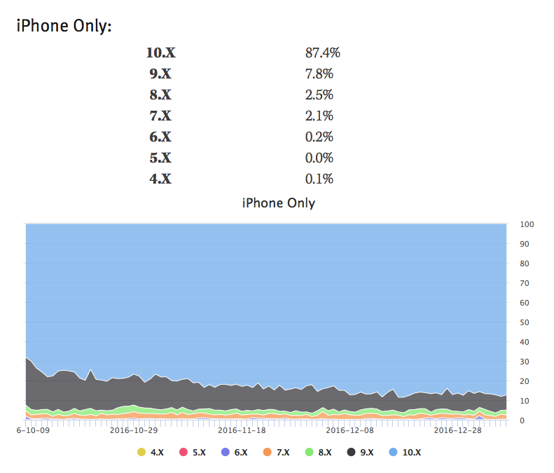
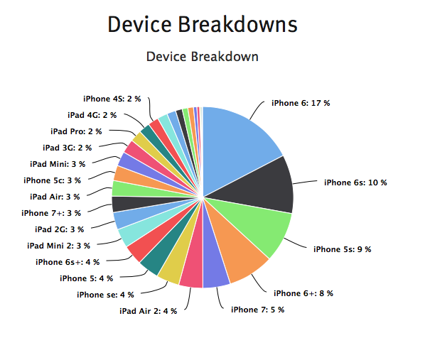

# ios-start

<p text-align="center"></p>
<p text-align="center"></p>


> 安装插件

``
sudo curl -fsSL https://raw.githubusercontent.com/supermarin/Alcatraz/deploy/Scripts/install.sh | sh  ---install plugin
rm -rf ~/Library/Application\ Support/Developer/Shared/Xcode/Plug-ins/Alcatraz.xcplugin ---uninstall plugin
rm -rf ~/Library/Application\ Support/Alcatraz ---remove all cache data

```

> 关键字

```
 关键字：NS 、self 、super 、alloc 、init、 release、 @property 、@property(strong/remain/copy/weak/assign、setter/getter、nonatomic/atomic、readonly/readwrite)
```


> 虚函数

```
1、OC 中 所有成员方法都是 虚函数
```

> 不能被继承的类 类似 final 类

```
NSString 、 NSArray 、NSDictionary 这三个类不能被继承
```


> 协议

```
1、oc无多继承，但可通过其可实现多继承
```


> 类目（分类、类别）

```
使用：扩展别人的类（可替代子类）

1、不能用来添加成员变量、只能添加方法
2、可替代子类
3、同一类放在多个文件中，便于协作
4、可以被继承
```


> 类延展属性的访问权限

```
作用：定义私有属性或方法

1、oc中属性没有 public private protected关键字
2、其访问权限是根据其写的位置确定
3、写在类的延展中是 private
4、普通类在 .h 文件中声明的属性或方法为 public 
```

> 

> id

```
oc中的id是一种数据类型，可以存放任何数据的对象，万能指针 id==NSObject*
```

> SEL 类型

```
SEL是一个类型，用SEL声明的一个变量，里面装的是消息
SEL s = @selector(methodName)
```

> block

```
block：块语法，本质上是匿名函数。与函数指针很相似：int（*）（int x，int y）
block定义： int (^myblock)(int) = ^(int num){return num * 7;};
解释：myblock为block变量，block类型：int(^)(int),block的值：^int (int num){return num * 7;}
形式：^返回值类型（参数列表）｛函数体｝，其中返回值类型可以省略
```

> property

```
1、atomic 加上线程安全锁（多线程），nonatomic 不会加线程安全锁（非多线程）
2、assign: 对基础数据类型 （NSInteger，CGFloat）和C数据类型（int, float, double, char, 等等）,
2.1、retain： 对其他NSObject和其子类
2.3、copy： 对NSString
3、readonly，readwrite ：用于访问权限控制
4、setter=setter方法名字，getter=getter方法名字， 自定义方法名的
5、strong与retain功能相似；weak与assign相似，只是当对象消失后weak会自动把指针变为nil
注：参数作用是-自动生成私有属性或其它属性的setter和getter方法的声明和实现
```
> 资源列表

+ [IOS 精讲-类目、延展、协议、属性、内存管理、Block](https://www.chuanke.com/v4702151-153167-581927.html)

+ [oc block使用](http://www.th7.cn/Program/IOS/201502/397959.shtml)

+ [IOS感应器](http://www.jianshu.com/p/233be81b8ead)

+ [IOS中权限](http://blog.csdn.net/Arnly/article/details/52904638)

+ [快速确定 OC中@property 中的参数](http://bbs.itheima.com/thread-330152-1-1.html)

+ [ios约束布局](http://blog.csdn.net/pucker/article/details/41843511)

+ [ios AutoLayout 详解](http://www.cocoachina.com/ios/20151020/13825.html)

+ [为iPhone 6设计自适应布局](http://www.cocoachina.com/ios/20141020/9978.html)

+ [iOS 开发----Storyboard/xib 连线问题](https://my.oschina.net/u/2458687/blog/505839)

+ [IOS开发基础常用控件简介 ](http://www.open-open.com/solution/view/1422433408017/)

+ [IOS 控件之基础整理 ](http://blog.csdn.net/edgargwjchangemyself/article/details/45678353)

+ [ IOS视图之基础整理 ](http://blog.csdn.net/edgargwjchangemyself/article/details/45678545)

+ [IOS之基本UI控件 ](http://www.2cto.com/kf/201502/376744.html)

+ [iOS基本UI控件总结 ](http://www.tuicool.com/articles/qmMjQnJ)

+ [苹果AppStore被拒理由大全](https://github.com/jcccn/Why-Reject)

+ [IOS 开源列表](http://www.cnblogs.com/oc-bowen/p/5590825.html)

+ [iOS 当前各版本所占比例](https://david-smith.org/iosversionstats/)

+ [IOS 百度传课](http://www.chuanke.com/course/_ios_____2.html?page=2)

+ [IOS多线程](http://www.chuanke.com/v4242218-178896-935590.html)）

+ [iOS 打测试包流程 在fir上发布](https://www.oschina.net/code/snippet_2248391_51855)

+ [Pod使用，Pod安装慢解决、Podfile 被安装后，使用 xcworkspace 打开项目](http://blog.csdn.net/eqera/article/details/39312125)
